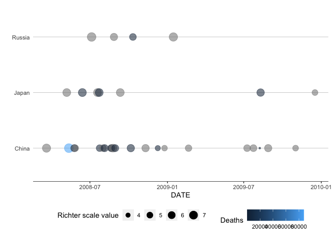
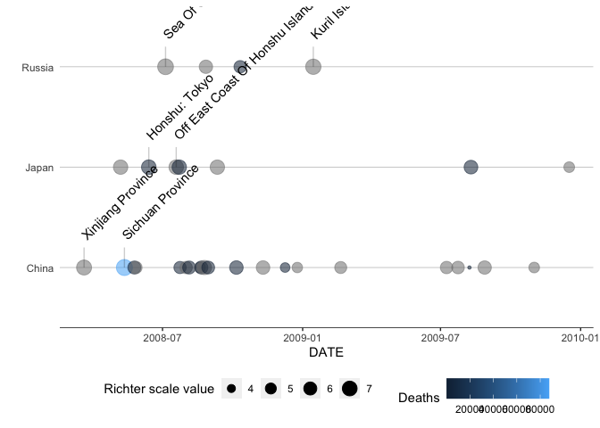

<!-- README.md is generated from README.Rmd. Please edit that file -->

# Mastercap Earthquake Data Visualization Package

<!-- badges: start -->

<!-- badges: end -->

The goal of this package (‘mastercap’) is to provide a few simple tools
to make it easier to visualize earthquake data. It is part of the final
capstone of the Mastering Software Development in R Coursera
specialization.

The four main functions are: 1. clean\_eq\_data() takes raw earthquake
data and reformats it into a tidy Tibble 2. geom\_timeline() takes an
earthquake Tibble and produces a visual timeline of earthquakes 3.
geom\_timeline\_label() is the same as geom\_timeline() but also adds
labels 4. eq\_map() plots earthquakes on an interactive, annotated map

## Example

The first example cleans the raw data and produces an earthquake
timeline to display earthquakes in China, Russia, and Japan between Jan
1, 2008, and Jan 1, 2010.

``` r
raw_data %>%
  mastercap::clean_eq_data() %>%
  mastercap::geom_timeline(mindate = "2008-01-01",
                maxdate = "2010-01-01",
                countries = c("China", "Russia", "Japan"))
#> Warning: `tbl_df()` is deprecated as of dplyr 1.0.0.
#> Please use `tibble::as_tibble()` instead.
#> This warning is displayed once every 8 hours.
#> Call `lifecycle::last_warnings()` to see where this warning was generated.
#> Warning: 3 failed to parse.
```



The second example demonstrates the same plot but uses the
geom\_timeline\_label function.

``` r
raw_data %>%
  mastercap::clean_eq_data() %>%
  mastercap::geom_timeline_label(mindate = "2008-01-01",
                      maxdate = "2010-01-01",
                      countries = c("China", "Russia", "Japan"))
#> Warning: 3 failed to parse.
```



The final example demonstrates eq\_map. It uses the same filtered data.

``` r
raw_data %>%
  mastercap::clean_eq_data() %>%
  dplyr::filter(date >= "2008-01-01",
         date <= "2010-01-01",
         country == c("China", "Russia", "Japan")) %>%
  mastercap::eq_map()
```

<!--html_preserve-->

<div id="htmlwidget-dd2556aaf7df965e971e" class="leaflet html-widget" style="width:100%;height:480px;">

</div>

<script type="application/json" data-for="htmlwidget-dd2556aaf7df965e971e">{"x":{"options":{"crs":{"crsClass":"L.CRS.EPSG3857","code":null,"proj4def":null,"projectedBounds":null,"options":{}}},"calls":[{"method":"addTiles","args":["//{s}.tile.openstreetmap.org/{z}/{x}/{y}.png",null,null,{"minZoom":0,"maxZoom":18,"tileSize":256,"subdomains":"abc","errorTileUrl":"","tms":false,"noWrap":false,"zoomOffset":0,"zoomReverse":false,"opacity":1,"zIndex":1,"detectRetina":false,"attribution":"&copy; <a href=\"http://openstreetmap.org\">OpenStreetMap<\/a> contributors, <a href=\"http://creativecommons.org/licenses/by-sa/2.0/\">CC-BY-SA<\/a>"}]},{"method":"addCircleMarkers","args":[[32.71,39.03,39.802,32.747,32.756,25.051,30.901,26.272,23.97,31.158,34.921],[105.54,140.881,141.464,105.542,105.494,97.919,83.52,101.937,97.569,85.902,139.261],[5.7,6.9,6.8,5.6,6,5,6.7,5.9,4.8,5.8,4.9],null,null,{"interactive":true,"className":"","stroke":true,"color":"#03F","weight":1,"opacity":0.5,"fill":true,"fillColor":"#03F","fillOpacity":0.1},null,null,["<b>Location:<\/b>  Sichuan Province <br><b>Magnitude:<\/b>  5.7  <br><b>Date:<\/b>  2008-05-27","<b>Location:<\/b>  Honshu: Tokyo <br><b>Magnitude:<\/b>  6.9 <br><b>Total deaths:<\/b>  13 <br><b>Date:<\/b>  2008-06-13","<b>Location:<\/b>  Honshu: N <br><b>Magnitude:<\/b>  6.8 <br><b>Total deaths:<\/b>  1 <br><b>Date:<\/b>  2008-07-23","<b>Location:<\/b>  Sichuan Province <br><b>Magnitude:<\/b>  5.6 <br><b>Total deaths:<\/b>  1 <br><b>Date:<\/b>  2008-07-24","<b>Location:<\/b>  Sichuan Province <br><b>Magnitude:<\/b>  6 <br><b>Total deaths:<\/b>  4 <br><b>Date:<\/b>  2008-08-05","<b>Location:<\/b>  Yunnan Province <br><b>Magnitude:<\/b>  5  <br><b>Date:<\/b>  2008-08-19","<b>Location:<\/b>  Tibet (Xizang Province) <br><b>Magnitude:<\/b>  6.7  <br><b>Date:<\/b>  2008-08-25","<b>Location:<\/b>  Sichuan Province <br><b>Magnitude:<\/b>  5.9 <br><b>Total deaths:<\/b>  43 <br><b>Date:<\/b>  2008-08-30","<b>Location:<\/b>  Yunnan Province: Simao <br><b>Magnitude:<\/b>  4.8  <br><b>Date:<\/b>  2008-12-25","<b>Location:<\/b>  Tibet (Xizang Province): Gyungcan <br><b>Magnitude:<\/b>  5.8  <br><b>Date:<\/b>  2009-07-24","<b>Location:<\/b>  Honshu: Ito <br><b>Magnitude:<\/b>  4.9  <br><b>Date:<\/b>  2009-12-17"],null,null,{"interactive":false,"permanent":false,"direction":"auto","opacity":1,"offset":[0,0],"textsize":"10px","textOnly":false,"className":"","sticky":true},null]}],"limits":{"lat":[23.97,39.802],"lng":[83.52,141.464]}},"evals":[],"jsHooks":[]}</script>

<!--/html_preserve-->
